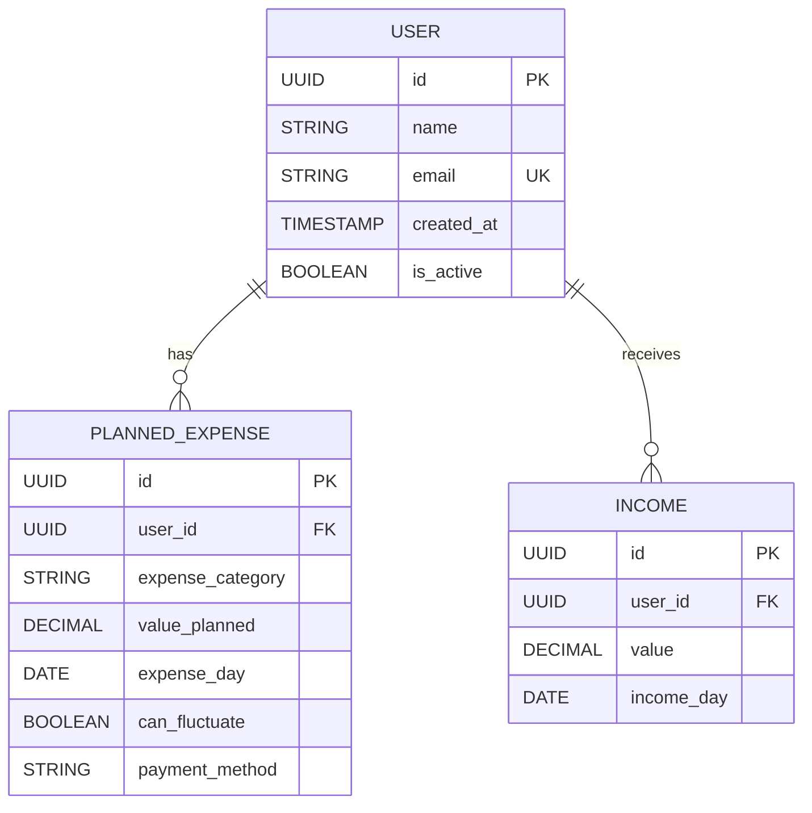

# 14. Difine Entity Relationship Diagram

Date: 2024-09-13

## Status

Accepted

## Context

The app requires a structured database to store information about users, planned monthly expenses, and incomes. The goal is to support daily expense tracking and simulations based on user-provided data. 

The core entities we need to manage are:
- **User**: The app user who owns the data.
- **Planned Expenses**: Monthly planned expenses that can be variable or fixed.
- **Income**: Recorded income values and the dates they are received.

This schema should enable the core functionality of calculating daily simulations by using planned expenses and income data without additional complexity.

## Decision

We will use the following **Entity Relationship Diagram (ERD)** for V1 of the app:

**Explanation of Entities:**
- **USER**: Stores basic user information, such as the name, email, account creation date, and active status.
- **PLANNED_EXPENSE**: Holds details about the planned monthly expenses, including the expense category (e.g., groceries, rent), the planned value, the day of the month the expense is due, whether the expense value can fluctuate, and the payment method.
- **INCOME**: Captures the income amount and the date it is or will be received by the user.

## Consequences

- Pros:
  - The structure is simple and sufficient for the core features of V1.
  - The schema allows the app to generate daily simulations based on planned expenses and income records without needing to store simulated data.
  - **can_fluctuate** field in PLANNED_EXPENSE helps handle both fixed and variable expenses efficiently.

- Cons:
  - As the app grows, additional complexity (e.g., recurring expenses, multiple user types) may require schema extensions.
  - The reliance on real-time calculations for simulations may impact performance as data scales, but this is not a concern for V1's limited scope.